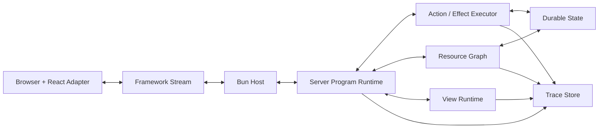

# Runtime Architecture

This file describes the framework's runtime shape: host, kernel, resource graph, views, stream, React adapter, traces, and the relationship to RSC/Flight. For vocabulary and thesis context, read [model.md](model.md) first.

## Runtime Shape

At one level down, the framework is a set of cooperating parts.



### Bun Host

The Bun host is the first runtime target.

Responsibilities:

- serve the development shell
- provide request and socket entrypoints
- load the server program
- host the custom stream transport
- integrate with Bun's bundling and dev server capabilities over time
- run Bun-native asset hooks for styles and other development outputs
- provide the first local development story

Bun should be treated as the practical host, not the whole architecture. The model should still be shaped by serverless constraints: processes can die, memory can disappear, and reconnect should be expected.

### Server Program Runtime

The server program runtime is the kernel.

Responsibilities:

- receive inputs from the stream
- create or resume views
- route inputs to actions, UI events, resource events, or system navigation
- resolve screens and observed resources
- apply route transitions and preserve view/UI checkpoints
- coordinate projection recomputation
- emit stream patches
- record traces

This is the main thing we are building. The rest of the system exists to make this runtime useful.

### Resource Graph

The resource graph tracks typed observable state.

Responsibilities:

- identify resources by stable typed keys
- resolve cache scope for resources whose values vary by fanout, principal, or custom context
- read resource values through effectful loaders
- track which screens or views observe which resources
- mark all observed scoped variants stale when actions invalidate a base resource key
- recompute affected projections
- support live resource updates later

The resource graph is the answer to fetch/cache soup. The developer should not manually decide which local query cache to poke after every action. The program should know what changed.

Resource identity has two layers. The base identity is the app-facing key, such as
`PendingDeployments(teamId)`. The cache identity also includes the resolved scope when a resource is
permission-, principal-, tenant-, or fanout-shaped. The first invalidation contract should favor
correctness: invalidating a base key refreshes all observed scoped variants of that key.

### Action And Effect Executor

The action/effect executor runs server transactions.

Responsibilities:

- validate action input
- provide effect services
- enforce capability boundaries
- run authorization checks
- perform durable writes
- emit resource invalidations
- emit trace events
- return action results or errors

This is where the functional programming influence should become practical. Effects are explicit because we want testability, traceability, and clear app boundaries, not because we want type theory theater.

### View Runtime

The view runtime owns per-tab conversation state.

Responsibilities:

- initialize UI state
- apply UI events
- associate a browser stream with a view
- remember observed resources and screen context
- support reconnect cursors
- restore or rebuild state after disconnect

The view is allowed to make the app feel live. It should not become an unsafe hidden database. The
key design pressure is:

```txt
If losing this state would corrupt the product, it should be a resource, not only UI state.
If the program does not need to observe it, it should stay renderer-owned and disposable.
```

### Stream Protocol

The stream protocol is the framework-owned communication layer.

It should carry:

- browser inputs to the server
- server projections to the browser
- incremental patches
- action lifecycle events
- resource update notifications
- trace events
- reconnect and resume cursors

The first stream can be intentionally small. It only needs to prove that typed inputs can update the UI without conventional endpoint calls or traditional SSR.

The stream should be custom at first. React Flight and RSC should remain inspirations and possible adapters, not the framework kernel.

### Projection Patches

The current canonical patch protocol is a region-value patch. Screens declare stable named regions
and a projection patch manifest. Runtime records which resources each region reads. When resources
are invalidated, affected views are found through the observation index and the runtime streams
`projection:patch` envelopes containing recomputed region values.

Adapters apply those values through the manifest. If a region is unpatchable or the manifest is
incompatible, the runtime and adapter must be able to fall back to a full projection update.

### React Adapter

The React adapter renders projections and hosts React components.

Responsibilities:

- mount the app shell
- connect browser events to framework inputs
- render server projections
- host client islands
- preserve compatibility with normal React components
- keep React ecosystem libraries usable

React should not own data fetching, mutation, cache invalidation, or workflow state by default.
Those belong to the server program model. React may own renderer state that is outside the program
and safe to lose.

### Trace And Devtools Model

The trace model records causality.

Responsibilities:

- assign trace IDs to inputs/actions
- capture validation, auth, effects, writes, invalidations, and patches
- expose enough data for a timeline/debug panel
- help prove that the architecture makes apps easier to understand

The smallest useful trace is probably a structured list of events per input. It does not need a polished UI first. It does need to exist early enough to shape the runtime.

## Runtime Flows

### Initial Connection

```txt
1. Bun serves a minimal app shell.
2. The React adapter opens a framework stream.
3. The browser sends route, client identity, and optional resume cursor.
4. The server program creates or resumes a view.
5. The screen resolves route params and observed resources.
6. The resource graph reads current resource values.
7. The program computes a projection.
8. The projection streams to the browser.
9. The React adapter renders it.
```

This may produce HTML or JSX-like output as an implementation detail, but the conceptual primitive is the live projection stream, not traditional SSR.

### User Action

```txt
1. User clicks Approve.
2. React adapter sends an approveDeployment input.
3. Runtime starts a trace.
4. Action executor validates input.
5. Executor runs auth and permission effects.
6. Executor performs durable writes.
7. Action invalidates Deployment(id) and PendingDeployments(teamId).
8. Resource graph marks affected observations stale.
9. Runtime recomputes affected projection regions.
10. Stream sends patch and trace events.
11. React adapter updates the UI.
```

The developer sees one workflow transaction rather than a frontend event, an API call, a backend handler, a client cache mutation, and a separate debugging trail.

### Route Navigation

```txt
1. Browser history, hash, or a navigation control changes the target path.
2. The React adapter sends a system.navigate input for the current view.
3. Runtime resolves the route and params through registered screen routes.
4. Runtime updates the view checkpoint route and params.
5. Layout-level UI state remains available through the same view checkpoint.
6. The target screen observes resources and computes a projection.
7. Stream sends a full projection update for the route transition.
8. Later resource invalidations continue to patch named regions.
```

Navigation is a system input, not an app action. It can be traced and resumed, but it should not
look like a domain transaction.

### Live Resource Update

```txt
1. Incident timeline receives a new event.
2. IncidentTimeline(id) resource changes or is invalidated.
3. Resource graph finds connected views observing it.
4. Runtime recomputes the timeline projection.
5. Stream sends a patch to each relevant browser.
```

This is the LiveView-like feeling, but the durable resource remains the source of truth.

### Reconnect And Resume

```txt
1. Browser loses the stream.
2. Browser reconnects with view ID and last known cursor.
3. Runtime restores view snapshot if available.
4. Runtime re-observes durable resources.
5. Missing stream events are replayed if possible.
6. If replay is not possible, the current projection is recomputed.
7. Browser receives a consistent projection and continues.
```

The exact persistence mechanism is an implementation decision for later phases. The design point is that process death is normal, not exceptional.

## RSC, Flight, And React

React Server Components and React Flight are important inspirations:

- server/client boundaries are now mainstream
- server-side data access inside UI programs is accepted
- streaming UI payloads are part of the React mental model
- server functions/actions make client-to-server calls feel closer to app code

But the framework kernel should not start as a Flight implementation.

Reasons:

- Flight would make React's internal protocol shape the core model too early.
- The project needs freedom to experiment with views, resources, traces, and renderer-agnostic projections.
- React's RSC framework integration surface is still a specialized and unstable area.
- We want to learn whether the server-program model works before adopting a specific transport.

The intended relationship:

```txt
Framework kernel owns: program, messages, resources, views, effects, traces.
React adapter owns: rendering, client islands, ecosystem compatibility.
Future Flight adapter may own: RSC-compatible payload transport if it fits.
```

If Flight later helps preserve React compatibility without weakening the model, it can become an adapter. If it forces the project into traditional React framework gravity, it should stay out of the kernel.

## Renderer-Agnostic Pressure

The first useful adapter should be React web. That is where the ecosystem is.

Still, the kernel should avoid assuming that every projection is only a browser DOM tree forever. A future version might target:

- React Native
- a desktop/native UI layer
- a terminal UI
- a static or email renderer
- a testing renderer

This is not a first-prototype requirement. It is a design pressure. The early kernel should keep the concepts clean enough that React web is the first adapter, not the only possible reality.
